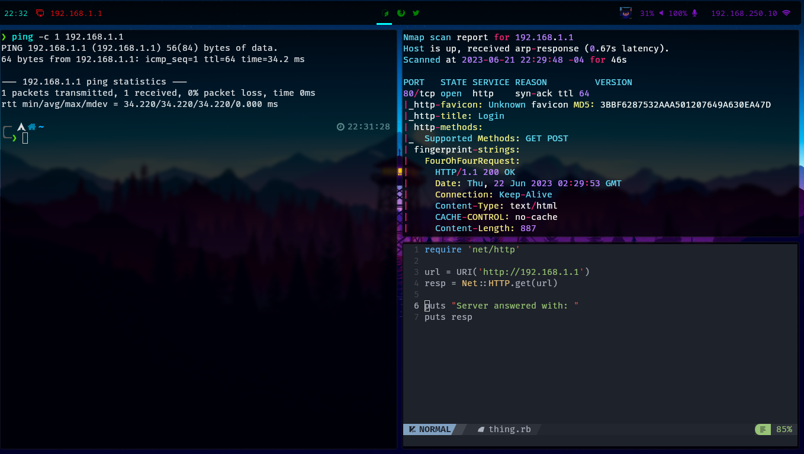

## Vz0n's box

This is my Arch Linux installation's dotfiles.

It's based on some rices that i saw among the Linux ricing community, but the inspiration came mainly from [s4vitar's bspwm](https://github.com/yorkox0/autoBspwm) and [rxyhn's dotfiles](https://github.com/rxyhn/yuki).

### Information

- OS: Arch Linux
- WM: [HyprLand](https://github.com/hyprwm/Hyprland)
- Bar: [Waybar](https://github.com/Alexays/Waybar)
- Locker: hyprlock/hypridle
- Terminal: [kitty](https://github.com/kovidgoyal/kitty) and zsh as shell (with oh-my-zsh).
- Notes: Obsidian
- Screenshots: flameshot
- Launcher: [fuzzel](https://codeberg.org/dnkl/fuzzel/)
- Fonts: Fira Code, Hack (Nerd)
- Widgets: [eww](https://github.com/elkowar/eww)

### Installation

Clone this repo and run the script `strap.sh`. It will install all the stuff needed for the environment to work and setup config files.

**Note:** There are still some things in config files that have my home directory hardcoded, I need to change it so, take note if you're installing this.

### My themes and terminal

I use powerlevel10k as default terminal theme, Sweet Dark + Bonny Dark Icons for GTK and a cute Anya cursor, just in case that you want to know (surely you actually don't want but uwu)

### Extra

As you might have seen, this has some scripts and a waybar widget for hacking/research purposes, the scripts works using the SecurityTrails API so you will need to put an API key in the `~/.api_tokens` file. 

For the waybar widget just read the code and `.zshrc`.

*Suggestion: read documentations of the software used here before starting to edit stuff*
