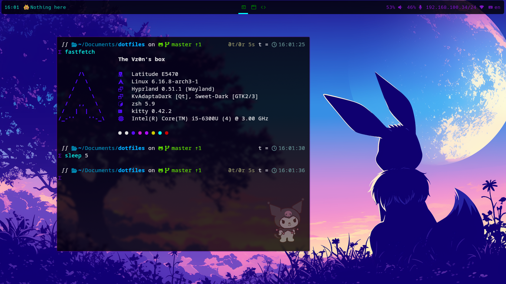

# Vz0n's box



This is my Arch Linux setup/rice.

You're free of cloning and use this config on your installation.

## Information

Some basic information about the setup

- OS: Arch Linux
- WM: [HyprLand](https://github.com/hyprwm/Hyprland)
- Bar: [Waybar](https://github.com/Alexays/Waybar)
- Terminal: [kitty](https://github.com/kovidgoyal/kitty)
- Shell: zsh
- Note taker: Obsidian
- Screenshots: flameshot
- Launcher: [rofi](https://github.com/davatorium/rofi)
- GTK Themes: Sweet Dark (Windows), Bonny Dark (Icons), Material Dark (Cursor)

## Installation

Install packages:
```BASH
pacman -S kitty thunar thunar-volman thunar-archive-plugin gvfs engrampa hyprland hyprpaper zsh pavucontrol obsidian gammastep brightnessctl pocl firefox dunst bat lsd gthumb git xdg-desktop-portal-hyprland xdg-desktop-portal nwg-look bpytop duf obsidian

# Use paru or another AUR helper
paru -i waybar-hyprland nerd-fonts-roboto-mono flameshot-git rofi-lbonn-wayland
```

Clone this repo: 

`git clone https://github.com/Vz0n/dotfiles`

Copy config files:

```BASH
cp -r config ~/.config
cp -r local ~/.local
cp .zshrc ~/.zshrc
```

Now tweak the config how you like and enjoy your new system!

*PS: Read documentations before you start to edit*
